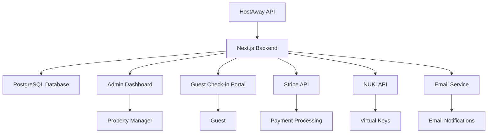

# Design Document

## Overview

The booking management dashboard is a modern web application built with a minimalistic Apple-inspired design using black and white color scheme. The system integrates with HostAway for booking data, Stripe for payments, and NUKI for virtual key management. The application consists of two main interfaces: an admin dashboard for property managers and a guest-facing check-in portal.

## Architecture

### Technology Stack
- **Frontend**: Next.js 14 with TypeScript
- **UI Components**: shadcn/ui for consistent, accessible components
- **Styling**: Tailwind CSS with black/white theme
- **Backend**: Next.js API routes
- **Database**: PostgreSQL with Prisma ORM
- **Authentication**: NextAuth.js for admin access
- **Email**: Resend or SendGrid for transactional emails
- **Payment**: Stripe SDK
- **External APIs**: HostAway, NUKI

### System Architecture



## Components and Interfaces

### Admin Dashboard Components

#### 1. Dashboard Layout
- **Header**: Navigation with logo, user profile, and logout
- **Sidebar**: Navigation menu with booking filters and status indicators
- **Main Content**: Booking grid/list view with search and filter controls

#### 2. Booking Card Component
```typescript
interface BookingCardProps {
  booking: {
    id: string;
    propertyName: string;
    guestLeaderName: string;
    checkInDate: Date;
    checkOutDate: Date;
    numberOfGuests: number;
    status: BookingStatus;
    taxPaid: boolean;
    registrationComplete: boolean;
    keysDistributed: boolean;
  };
}
```

#### 3. Booking Detail Modal
- Guest information table with completion status
- Tax calculation and payment status
- Virtual key distribution status
- Check-in link generation and email sending

#### 4. Filter Panel
- Status filters (checkboxes)
- Date range picker
- Guest count slider
- Property dropdown

### Guest Check-in Portal Components

#### 1. Landing Page
- Minimalistic design with booking information display
- Progress indicator showing check-in steps
- Apple-style card layout with subtle shadows

#### 2. Guest Information Form
- Dynamic form generation based on guest count
- Step-by-step wizard interface
- Form validation with real-time feedback
- shadcn/ui form components (Input, Select, DatePicker)

#### 3. Digital Signature Component
- Canvas-based signature capture
- Clear and retry functionality
- Signature preview and confirmation

#### 4. Payment Interface
- Stripe Elements integration
- Tax calculation display
- Payment confirmation screen

## Data Models

### Database Schema

```typescript
// Prisma Schema Models

model Booking {
  id                String    @id @default(cuid())
  hostAwayId        String    @unique
  propertyName      String
  guestLeaderName   String
  guestLeaderEmail  String
  guestLeaderPhone  String
  checkInDate       DateTime
  checkOutDate      DateTime
  numberOfGuests    Int
  roomNumber        String?
  checkInToken      String    @unique
  createdAt         DateTime  @default(now())
  updatedAt         DateTime  @updatedAt
  
  guests            Guest[]
  payments          Payment[]
  virtualKeys       VirtualKey[]
}

model Guest {
  id              String    @id @default(cuid())
  bookingId       String
  firstName       String
  lastName        String
  birthDate       DateTime
  nationality     String
  sex             String
  residenceCountry String
  email           String
  phone           String
  createdAt       DateTime  @default(now())
  
  booking         Booking   @relation(fields: [bookingId], references: [id])
}

model Payment {
  id              String    @id @default(cuid())
  bookingId       String
  stripePaymentId String    @unique
  amount          Int       // in cents
  currency        String    @default("CZK")
  status          String
  paidAt          DateTime?
  createdAt       DateTime  @default(now())
  
  booking         Booking   @relation(fields: [bookingId], references: [id])
}

model VirtualKey {
  id              String    @id @default(cuid())
  bookingId       String
  keyType         String    // main_entrance, luggage_room, laundry_room, room
  nukiKeyId       String
  isActive        Boolean   @default(true)
  createdAt       DateTime  @default(now())
  
  booking         Booking   @relation(fields: [bookingId], references: [id])
}
```

## API Integration Design

### HostAway Integration
```typescript
class HostAwayService {
  private apiKey = process.env.HOSTAWAY_API_KEY;
  private accountId = process.env.HOSTAWAY_ACCOUNT_ID;
  
  async fetchBookings(): Promise<HostAwayBooking[]>;
  async getBookingDetails(bookingId: string): Promise<HostAwayBooking>;
  async syncBookings(): Promise<void>;
}
```

### Stripe Integration
```typescript
class PaymentService {
  async createPaymentIntent(amount: number, bookingId: string): Promise<string>;
  async confirmPayment(paymentIntentId: string): Promise<boolean>;
  async calculateTouristTax(guests: Guest[], days: number): Promise<number>;
}
```

### NUKI Integration
```typescript
class VirtualKeyService {
  async generateKeys(booking: Booking): Promise<VirtualKey[]>;
  async createMainEntranceKey(): Promise<string>;
  async createRoomKey(roomNumber: string): Promise<string>;
  async deactivateKeys(bookingId: string): Promise<void>;
}
```

## User Interface Design

### Design System
- **Color Palette**: Pure black (#000000) and white (#FFFFFF) with subtle grays
- **Typography**: System fonts (SF Pro on Apple devices, fallback to Inter)
- **Spacing**: 8px grid system
- **Border Radius**: Minimal (4px-8px)
- **Shadows**: Subtle, Apple-style shadows
- **Components**: shadcn/ui components with custom black/white theme

### Admin Dashboard Layout
```
┌─────────────────────────────────────────────────────┐
│ Header: Logo | Search | Profile                     │
├─────────────────────────────────────────────────────┤
│ Filters Panel                                       │
│ ┌─────────────────────────────────────────────────┐ │
│ │ Status • Date Range • Guests • Property        │ │
│ └─────────────────────────────────────────────────┘ │
├─────────────────────────────────────────────────────┤
│ Booking Grid                                        │
│ ┌─────────┐ ┌─────────┐ ┌─────────┐ ┌─────────┐   │
│ │Booking 1│ │Booking 2│ │Booking 3│ │Booking 4│   │
│ │Status   │ │Status   │ │Status   │ │Status   │   │
│ └─────────┘ └─────────┘ └─────────┘ └─────────┘   │
└─────────────────────────────────────────────────────┘
```

### Guest Check-in Flow
1. **Landing Page**: Booking details with clean card layout
2. **Guest Count Confirmation**: Simple counter interface
3. **Guest Information**: Step-by-step form for each guest
4. **Review**: Summary of all entered information
5. **Signature**: Canvas-based signature capture
6. **Payment**: Stripe-powered payment interface
7. **Confirmation**: Success page with virtual key information

## Error Handling

### API Error Handling
- Graceful degradation for external API failures
- Retry mechanisms with exponential backoff
- User-friendly error messages
- Logging and monitoring for debugging

### Form Validation
- Real-time validation with shadcn/ui form components
- Clear error messages with suggestions
- Progressive enhancement for accessibility

### Payment Error Handling
- Stripe error handling with user-friendly messages
- Payment retry mechanisms
- Failed payment notifications to admin

## Testing Strategy

### Unit Testing
- Component testing with React Testing Library
- API route testing with Jest
- Database model testing with Prisma

### Integration Testing
- End-to-end testing with Playwright
- API integration testing
- Payment flow testing with Stripe test mode

### User Acceptance Testing
- Mobile responsiveness testing
- Accessibility testing (WCAG compliance)
- Cross-browser compatibility testing

## Security Considerations

### Data Protection
- GDPR compliance for guest data
- Encrypted storage of sensitive information
- Secure API key management

### Authentication & Authorization
- Admin authentication with NextAuth.js
- Rate limiting on API endpoints
- CSRF protection

### Payment Security
- PCI DSS compliance through Stripe
- No storage of payment card data
- Secure webhook handling

## Performance Optimization

### Frontend Optimization
- Next.js static generation where possible
- Image optimization with Next.js Image component
- Code splitting and lazy loading
- Minimal bundle size with tree shaking

### Backend Optimization
- Database query optimization with Prisma
- API response caching
- Background job processing for email sending
- Connection pooling for database

## Deployment Architecture

### Production Environment
- Vercel deployment for Next.js application
- PostgreSQL database (Supabase or Railway)
- Environment variable management
- CDN for static assets

### Monitoring & Analytics
- Error tracking with Sentry
- Performance monitoring
- User analytics (privacy-compliant)
- API usage monitoring